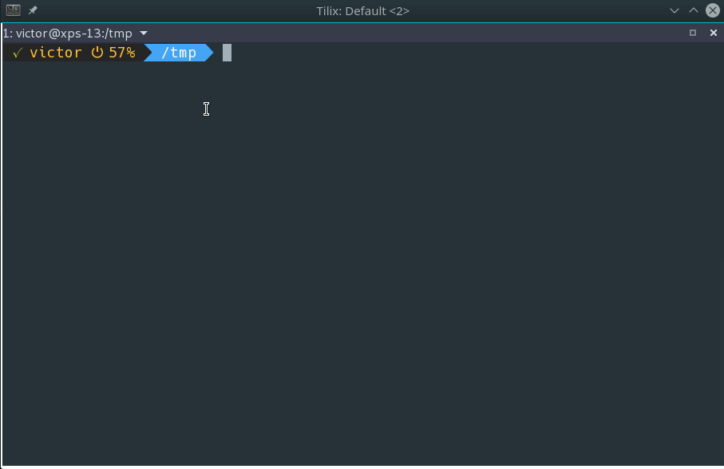

Powerline-simple is a simple powerline prompt for Bash, written by yours truly.

The prompt displays the following information:

* Previous exit code
* Username
* Hostname (when connecting via SSH)
* Battery status
* sudo cached credentials
* Current path
* Git status

You can download it from the [GitHub](https://github.com/victorbrca/powerline-simple) project page.
