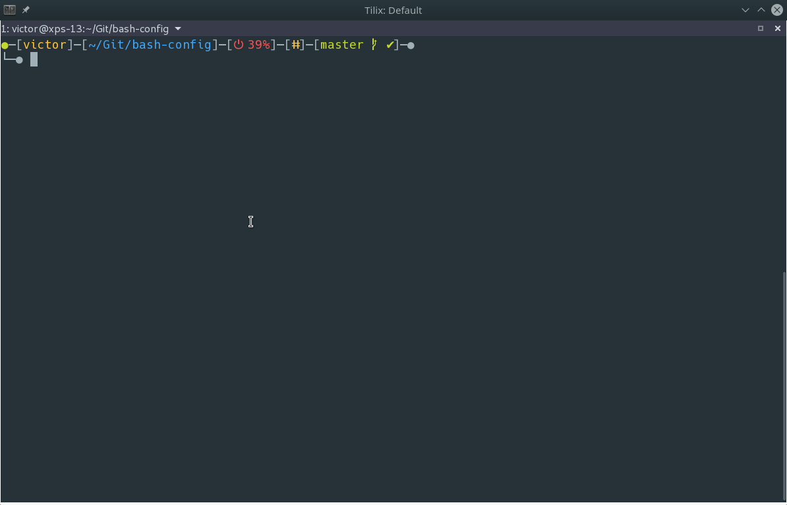
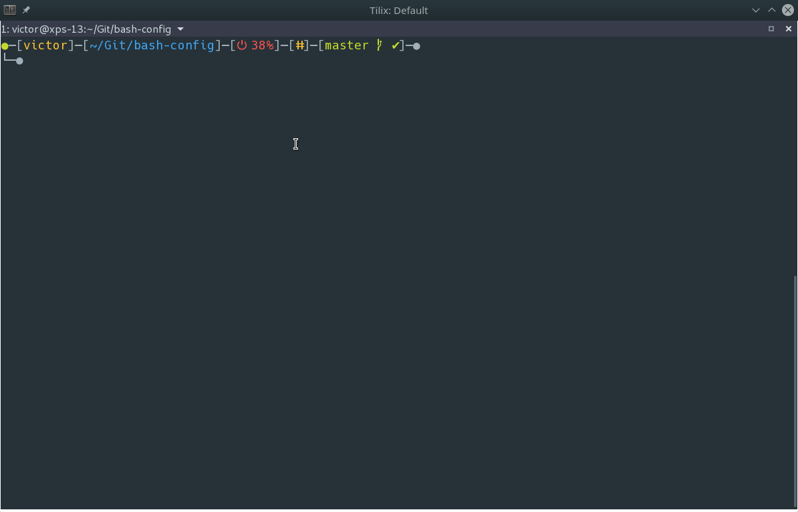
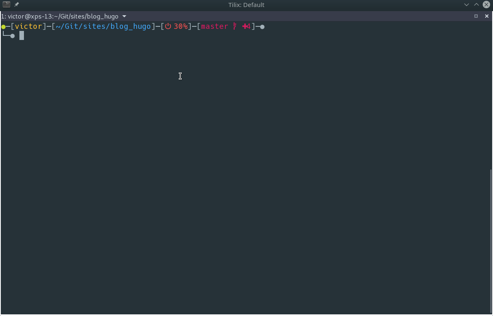

If you never heard of `fzf`, it's a command line fuzzy finder that can be used for




```bash
git-commit-show ()
{
  git log --graph --color=always --format="%C(auto)%h%d %s %C(black)%C(bold)%cr"  | \
   fzf --ansi --no-sort --reverse --tiebreak=index --preview \
   'f() { set -- $(echo -- "$@" | grep -o "[a-f0-9]\{7\}"); [ $# -eq 0 ] || git show --color=always $1 ; }; f {}' \
   --header "Git commit browser" \
   --bind "j:down,k:up,alt-j:preview-down,alt-k:preview-up,ctrl-f:preview-page-down,ctrl-b:preview-page-up,q:abort,ctrl-m:execute:
                (grep -o '[a-f0-9]\{7\}' | head -1 |
                xargs -I % sh -c 'git show --color=always % | less -R') << 'FZF-EOF'
                {}
FZF-EOF" --preview-window=right:60%
}
```



```bash
git-log-show ()
{
  trap "return 1" INT SIGINT
  while true ; do
    get_commit_hash=$(fzf --ansi --no-sort --reverse --tiebreak=index --preview 'git log --graph --color=always {}' --preview-window=right:60% \
    --header "File list" \
    --bind 'j:down,k:up,alt-j:preview-down,alt-k:preview-up,ctrl-f:preview-page-down,ctrl-b:preview-page-up,q:abort' | \
     xargs git log --format="%h [%ar] %-s%w(0,0,9)" --follow --all 2> /dev/null)
    if [ ! "$get_commit_hash" ] ; then
      return 1
    fi

    echo "$get_commit_hash" | fzf --ansi --no-sort --reverse --tiebreak=index --preview='git show --color=always {1}' --preview-window=right:60% \
    --header "Hash list" \
    --bind 'j:down,k:up,alt-j:preview-down,alt-k:preview-up,ctrl-f:preview-page-down,ctrl-b:preview-page-up,q:abort'

  done
}
```




```bash
git-diff-show ()
{
  git status -s | fzf --ansi --no-sort --reverse --tiebreak=index --preview='git diff --color {2} | diff-so-fancy' \
  --preview-window=right:60% --header "Diff list" \
  --bind 'j:down,k:up,alt-j:preview-down,alt-k:preview-up,ctrl-f:preview-page-down,ctrl-b:preview-page-up,q:abort'
}

```
